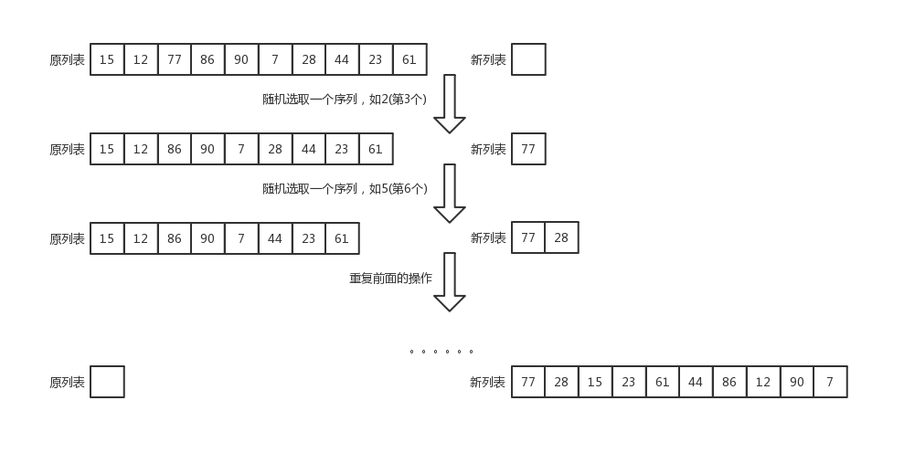
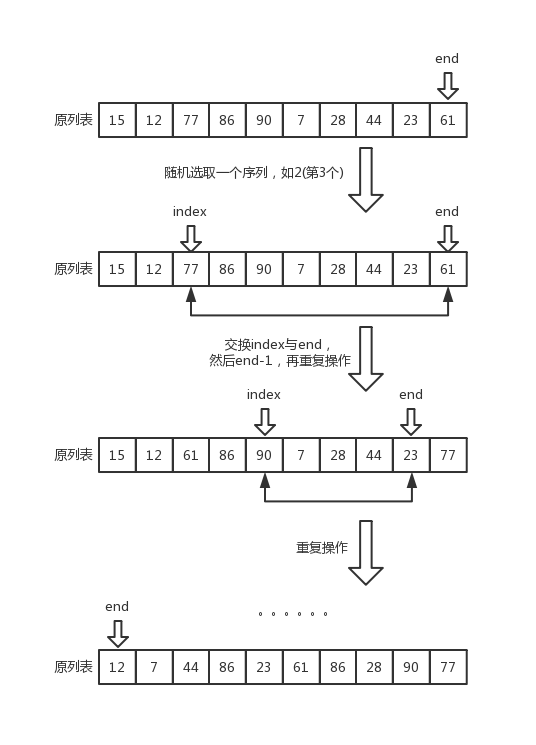
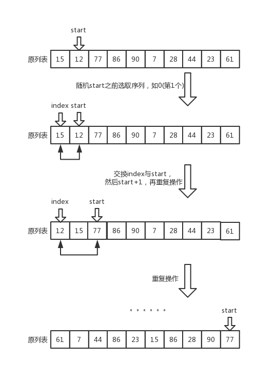

常见的算法题目： 把一个列表进行随机排序(打乱原来的排序)。这里不考虑保持原有列表顺序。
就像我们常见的斗地主的洗牌过程，将54张牌进行打乱，也就是我们说的洗牌算法。
(选择shuffle, 交换shuffle, 插入shuffle是自己的命名)


### 算法一：(选择shuffle)ISHER–YATES SHUFFLE 算法
基本思路：在长度的n的列表，随机选取第k个元素，将第k个元素加入到新列表中，并且在原列表中将第k个元素pop出， 重复前面的操作，直到原列表的长度为1。



```python
def select_shuffle(nums):

    length = len(nums)
    if length <= 1:
        return
    result = list()
    while length > 1:
    	# 产生一个随机序列 0 < index < length-1
        index = random.randrange(0, length)
        # 加入新列表中
        result.append(nums[index])
        # 从原表中弹出
        nums.pop(index)
        length -= 1
    # 将新列表的值赋给原列表
    nums.extend(result)
```
时间复杂度：O(n^2), 列表pop操作为O(n)操作
空间复杂度：O(n)


### 算法二：(交换shuffle)KNUTH-DURSTENFELD SHUFFLE 算法
基本思路：在长度为n的列表，随机选择第k个元素，将第k个元素和第n个元素进行交换，接着再取随机取第j个元素和第n-1元素进行交换，一直循环。



```python
def swap_shuffle(nums):
    length = len(nums)
    if length <= 1:
        return
    while length > 1:
        index = random.randrange(0, length)
        nums[index], nums[length-1] = nums[length-1], nums[index]
        length -= 1
```
时间复杂度：O(n)
空间复杂度：O(1)


### 算法三：(插入shuffle)INSIDE-OUT SHUFFLE 算法
基本思路：在长度为n的列表，从前向后遍历，在位置j时(j>1), 随机在[0, j]随机选择第i个元素，然后将第i元素和第j个元素进行交换，一直循环。这种方式看上去就像插入(并不是插入)。




```python
def insert_shuffle(nums):
    length = len(nums)
    if length <= 1:
        return
    # 从第2个元素向后遍历
    start = 1
    while start < length:
        index = random.randrange(0, start+1)
        nums[index], nums[start] = nums[start], nums[index]
        start += 1
```
时间复杂度：O(n)
空间复杂度：O(1)

