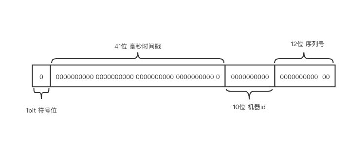

雪花算法是Twitter开源经典的分布式uuid生成方案，优势：

- 唯一性
- 基本有序性
- 性能高

# 算法原理

雪花算法由一个64位整数组成。


## 组成结构

1. 符号位。占1bit，1为负数，0为正数。由于uuid为正整数，固定为0。
2. 毫秒时间戳。占41位，这里值的不是实际的时间戳，而是一个**相对时间**。

        a. 以系统上线的时间为零点.
        b. 从这个时刻开始计算。可以表示2^41个整数，换算成时间，约为69年。
3. 机器id。占10位，可以表示1024个机器(实例)。具体的机器id位什么，可以自己指定，甚至可以使用一个自增的整数(如redis的incr)。
4. 序列号。占12位，可以表示4096个序号。表示并发情况下的同一毫秒的序列。

# 算法实现(python简单版)


```python
import time

# 64位整数划分
SIGN_BITS = 1  # 符号位
TIME_BITS = 41  # 时间戳
WORKER_BITS = 10  # 机器ID
SEQUENCE_BITS = 12  # 序号id

# 偏移量
# SEQUENCE_SHIFT = 0
WORKER_SHIFT = SEQUENCE_BITS  # 机器id偏移量
TIME_SHIFT = SEQUENCE_BITS + WORKER_BITS  # 时间戳偏移量

SEQUENCE_MASK = -1 ^ (-1 << SEQUENCE_BITS) # 11111 11111 11 序列号掩码

START_TIME = 1594046549722  # 时间戳

worker_id = 100
sequence = 0
last_timestamp = -1


def _generate_timestamp() -> int:
    # 产生当前毫秒时间戳
    return int(time.time()*1000)


def _wait() -> int:
    # 避免同一毫秒的时间序号使用完毕
    timestamp = _generate_timestamp()
    while timestamp <= last_timestamp:
        timestamp = _generate_timestamp()
    return timestamp


def get():
    global last_timestamp, sequence
    timestamp = _generate_timestamp()

    if timestamp < last_timestamp:
        # 时间回滚
        raise ValueError()

    if timestamp == last_timestamp:
        # 在同一毫秒内，序列号递增
        sequence = (sequence + 1) & SEQUENCE_MASK
        if sequence == 0:
            # 序号已满，等待下一毫秒
            timestamp = _wait()
    else:
        # 重置序列号
        sequence = 0
    last_timestamp = timestamp
    id_ = ((timestamp-START_TIME) << TIME_SHIFT) | worker_id << WORKER_SHIFT | sequence
    return id_

```

# 拓展

时间只有69年不够或者序列号不够怎么办？

由上面的原理可知，实际上雪花算法并没有强制每个部分使用几个位数。可以根据实际情况进行调整。

若机器或者实例不需要那么多，可以只使用8位、6位甚至更少，把多出来的位数给时间戳或者序列号。
也可以选择保留一部分位数以便将来的业务拓展。