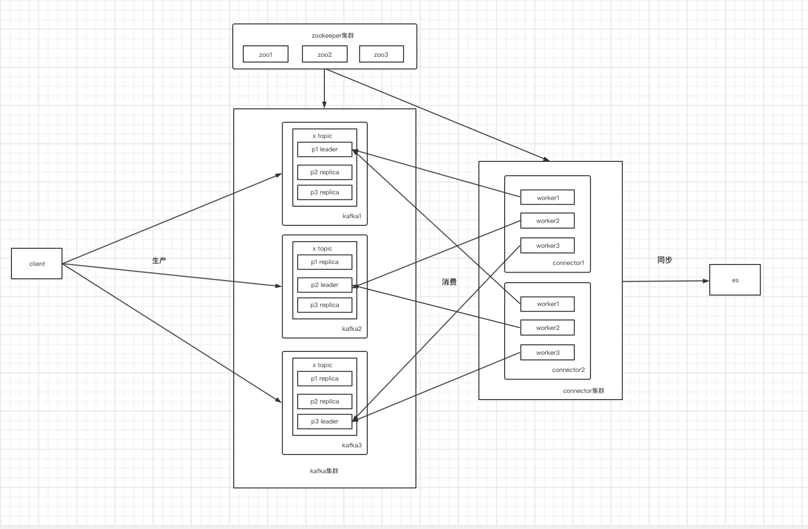

随着工作项目越来越多，并且由于未统一日志输出方式、是到文件、到控制台，各种类型到服务，如http，tcp等。发现日志越来越多，并发写入es的数量越来越多，导致es十分的不稳定，伴随着写入性能的堪忧，日志的丢失等等，各类服务需要写入重试的机制。最后，决定在引入中间件：kafka。

### why kafka?

1. 性能，kafka具有优秀的读写性能，极高的吞吐量。

2. 支持批量处理

3. 对于日志场景非常合适，logstash、filebeat等工具都直接支持kafka.

### 同步工具

- logstash
- kafka connector
- 自开发

由于时间成本问题，自己开发这种没有考虑。剩下两种都尝试了。

### kafka connector

第一次选型使用了这个connector, 主要是参考了网上的一些文章，觉得logstash可能不稳定，这个更好(实在太单纯)。当然了，既然踩过了坑，无论如何也要记录下来吧。或者是我使用方式不正确。
使用的是[kafka-connect-elasticsearch](https://github.com/confluentinc/kafka-connect-elasticsearch)

#### 基本架构


将json数据直接发送kafka中，写入log_开头的topic: log_($index_name), 然后会在elasticsearch中生成一个$index_name。

#### 部署connector

```shell
# 采用docker
docker run \
-p 8082:8082 \
-e CONNECT_BOOTSTRAP_SERVERS=kafka_addr:9092 \
-e CONNECT_REST_PORT=8082 \
-e CONNECT_GROUP_ID=_connector_es \
-e CONNECT_KEY_CONVERTER_SCHEMAS_ENABLE=false \
-e CONNECT_VALUE_CONVERTER_SCHEMAS_ENABLE=false \
-e CONNECT_CONFIG_STORAGE_TOPIC=_connector-es-config \
-e CONNECT_OFFSET_STORAGE_TOPIC=_connector-es-offset \
-e CONNECT_STATUS_STORAGE_TOPIC=_connector-es-status \
-e CONNECT_KEY_CONVERTER=org.apache.kafka.connect.json.JsonConverter \
-e CONNECT_VALUE_CONVERTER=org.apache.kafka.connect.json.JsonConverter \
-e CONNECT_REST_ADVERTISED_HOST_NAME=kafka-connect \
-e CONNECT_PLUGIN_PATH=/usr/share/java \
confluentinc/cp-kafka-connect:latest
```

#### 注册连接器

连接器的文档查看官方文档。

```python
# post http://#####/connectors/
#
 
{
  "name": "es-sink",  # connector名称
  "config": {
    "connector.class": "io.confluent.connect.elasticsearch.ElasticsearchSinkConnector",
    "tasks.max": "3",  # worker数量
    "topics.regex": "log_(.*)",  # 匹配kafka topic
    "key.ignore": "true",
    "schema.ignore": "true",
    "connection.url": "http://#####:9200/",  # es地址
    "type.name": "",  # 日志的_type名称，默认为_doc
    "name": "es-sink",   # connector名称, 与外层connector同名
    "value.converter.schemas.enable": "false",
    "key.converter.schemas.enable":"false",
    "auto.create": "true", # 自动创建topic
 
    # 对topic进行正则后对策略
    "transforms":"dropPrefix",
    "transforms.dropPrefix.type":"org.apache.kafka.connect.transforms.RegexRouter",
    "transforms.dropPrefix.regex":"log_(.*)",  # 丢弃topic名称部分
    "transforms.dropPrefix.replacement":"$1",  # 用什么代替丢弃的部分，这里表示，用正则出来的代替本来的，例如 name 代替 log_name
 
    "batch.size": 100,  # 批量写es
    "max.buffered.records": 1000,  # 单个worker最高并发写es的数量
    "flush.timeout.ms": 20000  # 写es超时时间
  }
}

```

connector会利用

#### 注册连接

### 算法二：(交换shuffle)KNUTH-DURSTENFELD SHUFFLE 算法
基本思路：在长度为n的列表，随机选择第k个元素，将第k个元素和第n个元素进行交换，接着再取随机取第j个元素和第n-1元素进行交换，一直循环。


```python
def swap_shuffle(nums):
    length = len(nums)
    if length <= 1:
        return
    while length > 1:
        index = random.randrange(0, length)
        nums[index], nums[length-1] = nums[length-1], nums[index]
        length -= 1
```
时间复杂度：O(n)
空间复杂度：O(1)


### 算法三：(插入shuffle)INSIDE-OUT SHUFFLE 算法
基本思路：在长度为n的列表，从前向后遍历，在位置j时(j>1), 随机在[0, j]随机选择第i个元素，然后将第i元素和第j个元素进行交换，一直循环。这种方式看上去就像插入(并不是插入)。


```python
def insert_shuffle(nums):
    length = len(nums)
    if length <= 1:
        return
    # 从第2个元素向后遍历
    start = 1
    while start < length:
        index = random.randrange(0, start+1)
        nums[index], nums[start] = nums[start], nums[index]
        start += 1
```
时间复杂度：O(n)
空间复杂度：O(1)

